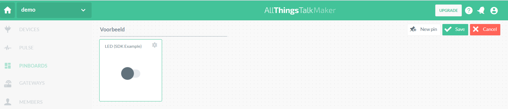

# Actuator

In onderstaande voorbeeld wordt de ingebouwde LED op de ESP8266 aangestuurd met het All Things Talk platform.

Bron: [All Things Talk example ESP8266](https://github.com/allthingstalk/arduino-wifi-sdk/tree/master/examples/ControlLed)

## Arduino code

```cpp
#include <AllThingsTalk_WiFi.h>

auto wifiCreds   = WifiCredentials("WiFiSSID", "WiFiPassword");   // Your WiFi Network Name and Password
auto deviceCreds = DeviceConfig("DeviceID", "DeviceToken");       // Go to AllThingsTalk Maker > Devices > (Your Device) > Settings > Authentication to get your Device ID and Token
auto device      = Device(wifiCreds, deviceCreds);                // Create "device" object
int  ledPin      = YourLedPin;                                    // Change YourLedPin to the pin you connected your LED to
char* asset      = "led-example";                                 // Name of asset on AllThingsTalk that you'll use to control the LED (automatically created below)

void setup() {
  Serial.begin(115200);                 // Baud rate: 115200, but you can define any baud rate you want
  pinMode(ledPin, OUTPUT);              // Set the pin of our LED to OUTPUT
  device.debugPort(Serial);             // Set AllThingsTalk library to output its debug to "Serial"
  device.setActuationCallback(asset, actuation);  // "asset" - Variable we defined above, "actuation" - Name of the function below that does the work
  device.createAsset("led-example", "LED (SDK Example)", "actuator", "boolean"); // Create asset "led-example" on your AllThingsTalk to control the LED
  device.init();                        // Initialize AllThingsTalk
}

void loop() {
  device.loop();                        // Keep AllThingsTalk & WiFi alive
}

void actuation(bool value) {            // Function called when message arrives to your specified asset. "value" is the actual value received.
  if (value == true) {
    digitalWrite(ledPin, HIGH);         // Set pin "ledPin" to HIGH (ON)
    Serial.println("LED Turned ON");    // Prints to serial port
  } else {
    digitalWrite(ledPin, LOW);          // Sets pin "ledPin" to LOW (OFF)
    Serial.println("LED Turned OFF");   // Prints to serial port
  }
}
```

Pas volgende delen aan:
* Your_WiFi naar de SSID van je wifi netwerk
* Your_WiFi_Password naar het paswoord van je wifi netwerk
* Your_Device_ID. Het Device ID is te vinden onder "Settings" - "Authentication". Het device ID kan gecopyeerd worden in de arduino code.


* Your_Device_Token naar het device token dat eveneens te vinden is onder Autentication.


## Instellen dashboard (pinboard bij All Things Talk)

Met een pinboard kan een actuator aangestuurd worden.

Kies PINBOARDS en vervolgens +NEW PINBOARD.


Klik op ARRANGE PINBOARD


Kies New pin.


Stel de pin in. We kiezen in het voorbeeld voor een togle knop.


Kies het device en de asset


Bewaar de pin



Voeg eventueel extra pins toe.

Via SHARE is het mogelijk de PIN beschikbaar te stellen.


## Opdrachten

* Test bovenstaande voorbeeld.
* Stuur 2 leds aan.
* Schakel een DC-motor in- en uit via een relais verbonden met de ESP8266.