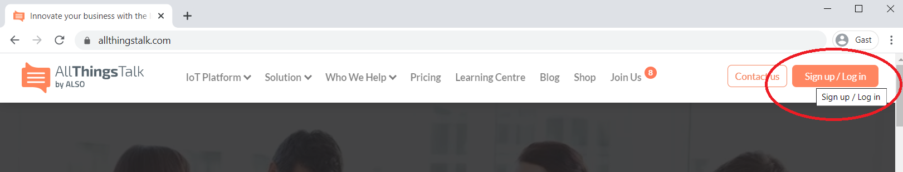
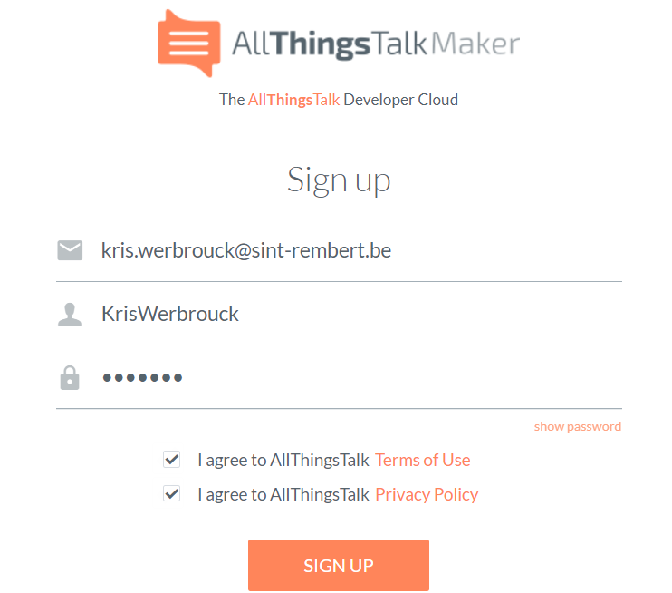
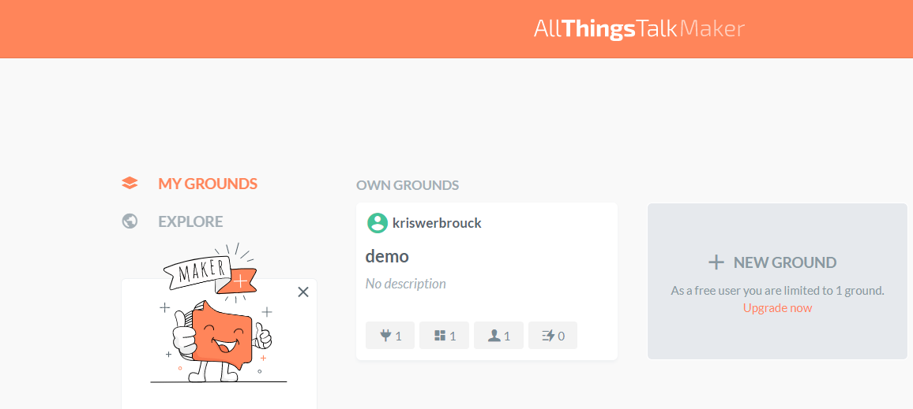
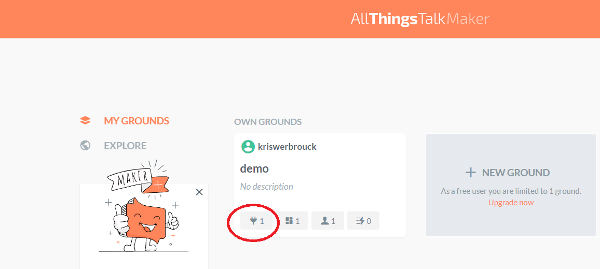
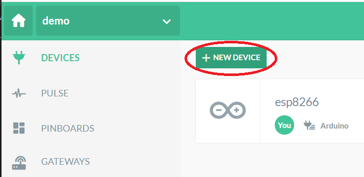
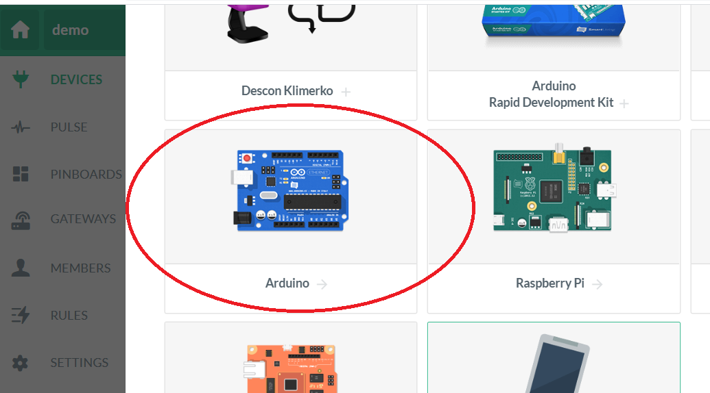
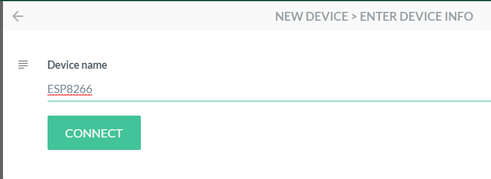
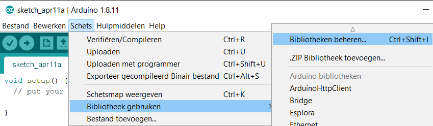
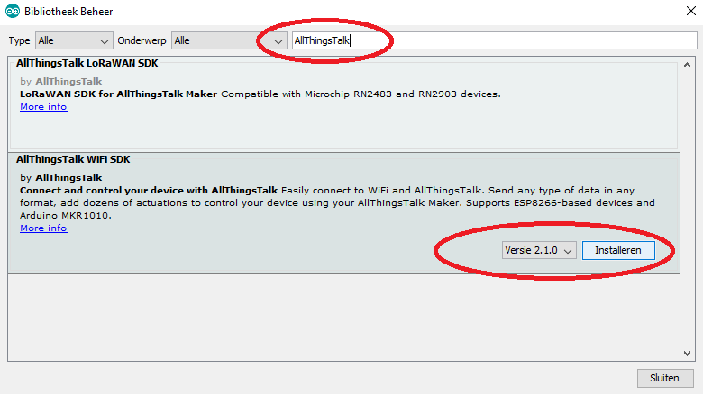
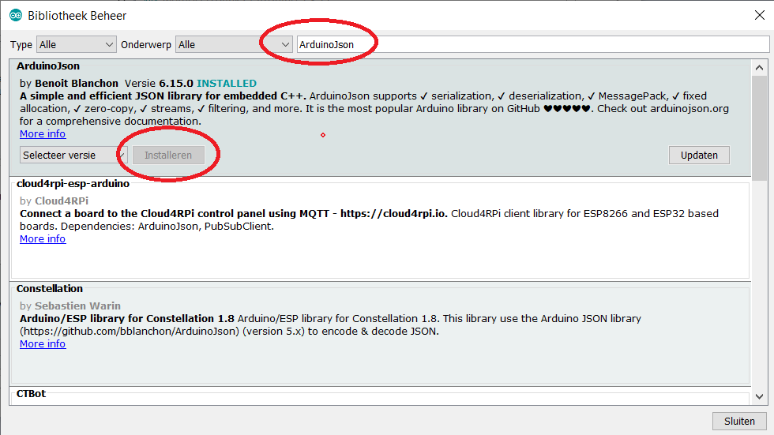

# Inleiding

All Things Talk [https://www.allthingstalk.com](https://www.allthingstalk.com/) was tot de zomer van 2019 een Vlaamse IOT start-up. Ondertussen is All Things Talk een onderdeel van de ALSO groep [www.also.com](www.also.com). De core business van het bedrijf is de bouw en het beheer van een IOT-platform. Daarnaast wordt hardware verkocht voor IOT samen met telecom bedrijven en netwerk service providers zoals The Things Network.

 Het IOT-platform van All Things Talk is zowel beschikbaar voor bedrijven, het onderwijs en de maker community. Er zijn echter beperkingen aan de gratis versie voor het onderwijs en de maker community.

 

[YouTube link naar de toepassingen in haven van Antwerpen](https://www.youtube.com/watch?v=09KxrJQde_Q)

Het is mogelijk om via verschillende devices (ESP8266, Raspberry pi, je eigen smartphone, ...) het IOT-platform van All Things Talk te benaderen. In deze cursus beperken we ons tot de ESP8266 microcontroller.

De All Things Talk maker account is beperkt tot:
* 1 groud.
* 5 devices per groud.
* 60 boodshappen per sliding window van 60 seconden.
* Beperking in het bewaren van de data in de tijd.

# Aanmaken account

Maak een account aan op het All Things Talk platform. [https://www.allthingstalk.com](https://www.allthingstalk.com/)

## Aanmaken ground

Maak een ground aan.

## Aanmaken device

In de ground kunnen verschillende devices toegevoegd worden. Maak een Device aan.

Klik vervolgens terug op +NEW DEVICE

Selecteer arduino voor de ESP8266

Geef het device een passende naam

## Bibliotheek van All Things Talk toevoegen

De wifi bibliotheek van All Things Talk is niet standaard aanwezig in Arduino IDE. We voegen deze toe.

Voeg de AllThingsTalk bibliotheek toe.

Voeg de ArduinoJson by Benoit Blanchon bibliotheek toe.

