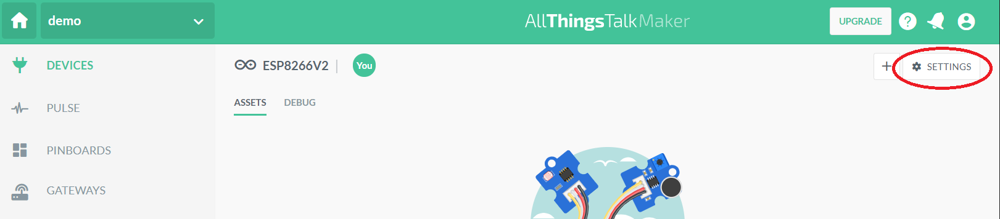

# Inleiding

All Things talk is een Vlaams IOT bedrijf dat hardware ontwikkeld en verkoopt. Eveneens stelt All Things Talk een IOT platform ter beschikking. Dit platform wordt door grote bedrijven gebruikt. Voor de maker community en het onderwijs is er een versie van het IOT platform beschikbaar die beperkt is tot "1 ground".

Het is mogelijk om via verschillende devices (ESP8266, Raspberry pi, je eigen smartphone, ...) het IOT platform van All Things talk te benaderen. In deze cursus beperken we ons tot de ESP8266 microcontroller.

De All Things Talk maker account is beperkt tot 
* 1 groud. (Wat houd deze beperking in?)
* Aantal devices per groud?
* Hoeveelheid data die kan doorgezonden worden? (per uur, minuut,...)


Maak een ground aan.


In de ground kunnen verschillende devices toegevoegd worden. Maak een Device aan.


Klik vervolgens terug op +NEW DEVICE


Selecteer arduino voor de ESP8266


Geef het device een passende naam


## Arduino code

```cpp
#include <AllThingsTalk_WiFi.h>       // Load (include) the AllThingsTalk WiFi SDK - Read more about it on https://gitub.com/allthingstalk/arduino-wifi-sdk

auto wifiCreds    = WifiCredentials("Your_WiFi", "Your_WiFi_Password");         // Your WiFi Network Name and Password
auto deviceCreds  = DeviceConfig("Your_Device_ID", "maker:Your_Device_Token");  // Go to AllThingsTalk Maker > Devices > Your Device > Settings > Authentication to get your Device ID and Token
auto device       = Device(wifiCreds, deviceCreds);                             // Create "device" object
char* sensorAsset = "analog-example";                                           // Name of asset on AllThingsTalk to which you'll receive the value (automatically created below)

const long    period        = 1000;   // Change this to change how many milliseconds you want between analog port readings
int           analogValue   = 0;      // Variable that will store the value of the analog port
unsigned long startMillis;            // Used to keep track of send intervals
unsigned long currentMillis;          // Used to keep track of send intervals

void setup() {                        // This function is only called once, when the device boots
  Serial.begin(115200);               // Starts the Serial port for debugging (at baud rate 115200)
  device.debugPort(Serial);           // Enable debug output from AllThingsTalk SDK. 
  device.wifiSignalReporting(true);   // Enable AllThingsTalk WiFi SDK's feature that sends NodeMCU's WiFi Signal Strength to your AllThingsTalk Maker
  device.createAsset(sensorAsset, "Analog Value", "sensor", "integer"); // Create asset on AllThingsTalk to send analog value to
  device.init();                      // Initialize WiFi and AllThingsTalk
  startMillis = millis();             // Saves the initial millis value at boot to startMillis variable
}

void analogCheck() {                               // This is the function that checks the value of analog port
  currentMillis = millis();                        // Saves the value of "millis()" at the time of execution of this line
  if (currentMillis - startMillis >= period) {     // If current time minus the last saved 'startMillis' time is bigger than the period defined above, it'll run the code below
    analogValue = analogRead(A0);                  // Reads the analog port A0 of ESP8266 (NodeMCU) and saves it to "analogButton" variable
    Serial.print("Current Analog Value: ");        // Prints to Serial port
    Serial.println(analogValue);                   // Prints to Serial port
    device.send(sensorAsset, analogValue);         // Sends the data to AllThingsTalk. Data is sent to "sensorAsset"
    startMillis = currentMillis;                   // Resets the startMillis by assigning it the value of currentMillis
  }
}

void loop() {        // Main code that'll be run in loop all the time
  device.loop();     // Keep AllThingsTalk and WiFi connection alive
  analogCheck();     // Runs our "analogCheck" function, which checks the value of analog port and publishes it
}
```

Pas volgende delen aan:
* Your_WiFi naar de SSID van je wifi netwerk
* Your_WiFi_Password naar het paswoord van je wifi netwerk
* Your_Device_ID naar your Device ID. Het Device ID is te vinden onder "Settings" - "Authentication". Het device ID kan gecopyeerd worden in de arduino code.




* Your_Device_Token naar het device token dat eveneens te vinden is onder Autentication.

